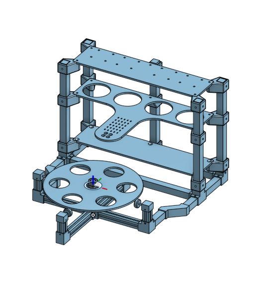
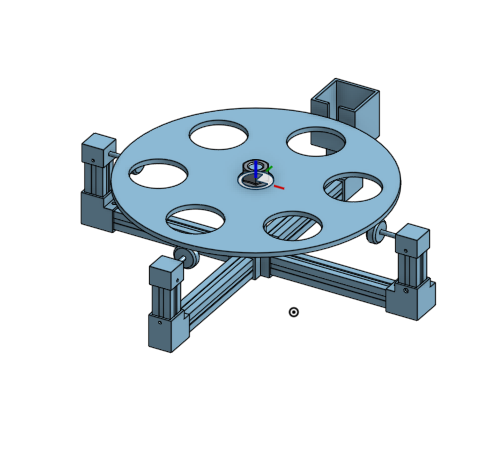
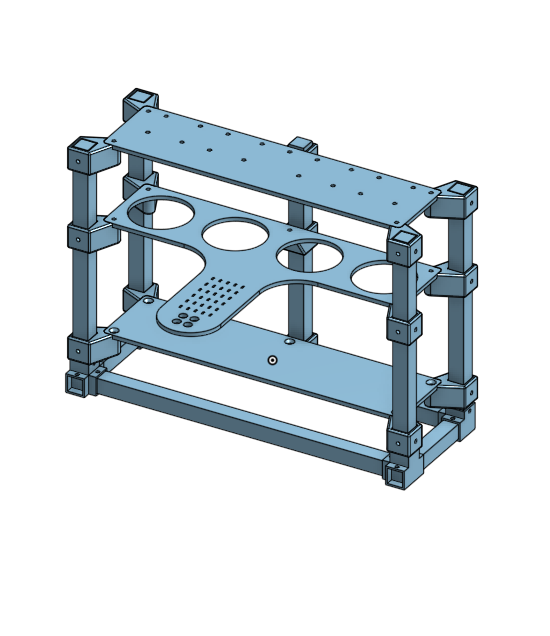

# Conception et prototypage

Cette section présente la conception du prototype **Mix&Go**, un distributeur automatique de liquides. Elle explique les principaux choix réalisés pour la structure, le plateau tournant et le système de distribution.

## Conception générale

Le prototype est composé de plusieurs parties :

- une structure principale ;
- un plateau tournant pour positionner les verres ;
- des supports pour les réservoirs ;
- un système de distribution avec des pompes ;
- une partie automatisation pour gérer le fonctionnement.

L’objectif est d’obtenir un système compact, stable et facilement modifiable.

## Plateau tournant

Le plateau tournant permet de placer plusieurs verres sur une même base.  
Il a pour rôle d’amener chaque verre sous la zone de distribution afin de recevoir le liquide.

Ce choix permet de limiter l’encombrement tout en rendant le système plus simple à automatiser.

## Distributeur à liquides

Le distributeur à liquides est conçu pour accueillir plusieurs réservoirs.  
Chaque réservoir est relié à une pompe, ce qui permet de distribuer différents liquides.

Les pompes permettent de contrôler plus facilement la quantité de liquide envoyée dans les verres.

## Structure du prototype

La structure doit supporter les différents éléments du système : plateau, réservoirs, pompes et pièces de fixation.

Elle est composée d’éléments rigides et de pièces imprimées en 3D.  
L’aluminium permet d’obtenir une bonne stabilité, tandis que le PLA et l’ABS permettent de fabriquer des pièces adaptées au prototype.

## Prototypage

Le prototypage permet de tester progressivement les différentes parties du système.

Les principales étapes sont :

1. modélisation des pièces ;
2. fabrication des éléments ;
3. assemblage de la structure ;
4. installation du plateau tournant ;
5. intégration des pompes et réservoirs ;
6. tests du fonctionnement.

## Améliorations prévues

Plusieurs améliorations peuvent encore être ajoutées :

- finaliser l’automatisation ;
- ajouter les pompes pour les quatre réservoirs ;
- améliorer la précision du dosage ;
- ajouter des capteurs de position pour détecter les verres ;
- rendre le système plus fiable et plus propre.

## Conclusion

La conception de **Mix&Go** repose sur une structure simple, compacte et évolutive.  
Le plateau tournant facilite le positionnement des verres, tandis que les pompes permettent une distribution contrôlée des liquides.
